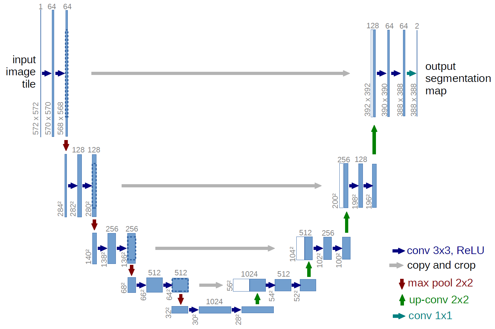

# Pytorch Segmentation
Apples segmentation using UNet


## Dataset
MinneApple: A Benchmark Dataset for Apple Detection and Segmentation
Download dataset:
```console
./get_data.sh
```
or:
https://conservancy.umn.edu/handle/11299/206575

## UNet
paper: https://arxiv.org/abs/1505.04597



## Results


