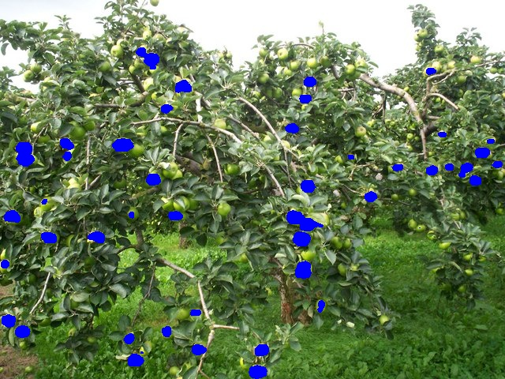

# Pytorch Segmentation
Apples segmentation using UNet


## Dataset
MinneApple Dataset. Download using bash script:
```console
./get_data.sh
```
Or directly from:
https://conservancy.umn.edu/handle/11299/206575

## UNet
Paper: https://arxiv.org/abs/1505.04597
Network:


## Results


